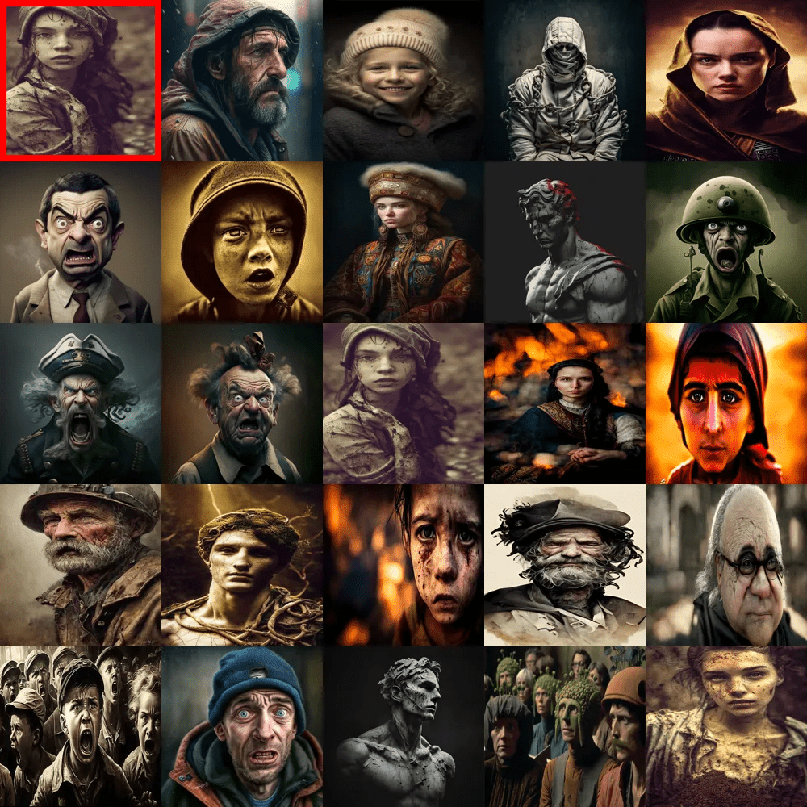
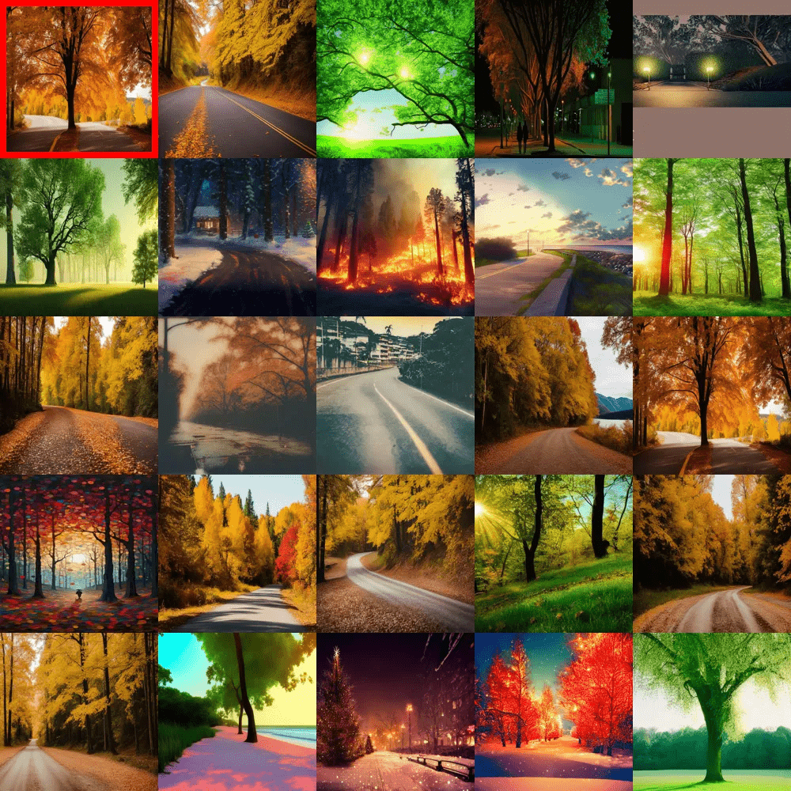

## Latent Image Similarity using ANNOY and PyTorch

## Overview

This project aims to implement image similarity using the ANNOY library and PyTorch. The major steps involved in this project include finalizing an embedding model, determining the number of dimensions and the metric for ANNOY, followed by deciding the number of trees ANNOY should build. 

## Results

- Images marked in red are the source image

<div style="display: flex; flex-wrap: wrap; justify-content: center;">
    
    
    
    
</div>


| Documents | Trees | Query Documents | Query Time |
| --------- | ------| --------------- | ---------- |
| 1000      | 10    | 24              | 0.01 sec   |
| 100000    | 20    | 1000            | 0.04 sec   |
| 200000    | 40    | 2000            | 0.06 sec   |


## Model

For the image embedding model, we will consider three popular models: ResNet50, ResNet18, and VGG16. These models are widely used for image recognition tasks and have been pre-trained on large-scale datasets. Each model has its own architecture and characteristics. Here's a brief overview of the models:

- ResNet50: ResNet50 is a deep convolutional neural network with 50 layers. It has achieved excellent performance on various image recognition tasks.

- ResNet18: ResNet18 is a shallower version of ResNet50 with 18 layers. It offers a good balance between model complexity and performance.

- VGG16: VGG16 is another popular deep convolutional neural network. It has a total of 16 layers and has shown strong performance on image classification tasks.

Below is an example code snippet to use ResNet50 for image embedding:

```python
import torch
import torchvision.models as models

# Load the pre-trained ResNet50 model
weights = models.ResNet50_Weights.IMAGENET1K_V2
model = models.resnet50(weights=weights)

# removing the last layer
model.fc = nn.Identity()
model.eval()

# transform
transform = transforms.Compose([
    transforms.Resize((224,224)),
    transforms.ToTensor()
])

# Get output tensor
image = Image.open(image_path)
input_tensor = transform(image).unsqueeze(0)
output_tensor = model(input_tensor)
```

## Indexing Algorithm

ANNOY (Approximate Nearest Neighbors Oh Yeah!) provides different indexing algorithms that can be used for efficient approximate nearest neighbor search. Let's compare some of the available ANNOY algorithms:

- Euclidean: The Euclidean algorithm calculates the Euclidean distance between vectors using the L2 norm. It is suitable for applications where the data is dense and the distance metric follows the Euclidean geometry. Euclidean distance works well when the dimensions have similar scales.

- Manhattan: The Manhattan algorithm, also known as the L1 norm or taxicab distance, calculates the sum of absolute differences between vector coordinates. It is appropriate when the data has sparse and high-dimensional representations or when the distance metric follows the Manhattan geometry.

- Dot Product: The Dot Product algorithm measures the similarity between vectors by computing the dot product between them. It works well when the vectors represent angles or when similarity is determined by the cosine of the angle between vectors. It is particularly useful in text-based applications such as information retrieval or document similarity.

- Angular: The Angular algorithm measures the angular distance between vectors, also known as the cosine distance or cosine similarity. It calculates the cosine of the angle between vectors, which captures the direction rather than the magnitude of the vectors. The Angular algorithm is often used for tasks where the similarity is based on the direction or orientation of vectors, such as recommender systems.

## Trees

In the context of the Annoy algorithm, "trees" refer to the underlying data structure used for indexing and searching nearest neighbors. Annoy uses a tree-based approach called Approximate Nearest Neighbors (ANN) to efficiently find approximate nearest neighbors in high-dimensional spaces.

- These trees, known as Random Projection Trees, are constructed by recursively partitioning the data points into smaller subsets based on random projections. Each subset represents a leaf node in the tree, and the structure allows for efficient search operations to find the approximate nearest neighbors.

- The number of trees in Annoy plays a crucial role in the trade-off between search accuracy and computational efficiency. Increasing the number of trees improves the accuracy of the nearest neighbor search but also increases the memory usage and search time. The optimal number of trees depends on the specific use case, dataset size, and desired trade-offs between accuracy and performance.


```python
from annoy import AnnoyIndex

n_trees = 20
dimensions = 2048 # number of features in embeded vector
metric = 'angular' # nearest neighbour selection

annoy_index = AnnoyIndex(dimensions,metric)
```
